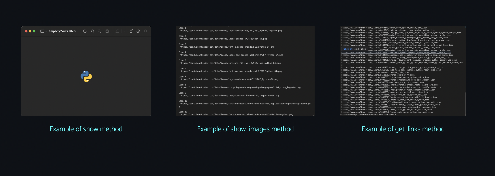

<p align="center">WebIconFinder : An unofficial  API for scraping images off IconFinder.com for web development.</p>
<div align="center">

</div>


## Initiate the Class  

```python

#To scrape for normal icons , create an instance of the class IconFinder with the name of the image to search  , for example :

from WebIconFinder import IconFinder # Import the class from the package
find_icon=IconFinder("mail")
```

###  1 : Scrape web links of images

```python

#To scrape for links of images , call the images() function from the initialized class , for example : 

find_icon=IconFinder("mail")
find_icon.images()
```

###  2 : Get Links to download and edit images

```python

#To scrape for links of images to download locally  , call the get_links() function from the initialized class , for example : 

find_icon=IconFinder("mail")
find_icon.get_links()
```

###  3: Show/Display a particular Icon

```python

#To display an Icon   , call the show_image(image_number:int) function from the initialized class , for example : 

find_icon=IconFinder("mail")
find_icon.show_image(2) # Shows the second image from all scraped images
```

###  4 : Download an icon

```python

#To download an icon locally  , call the save_image(path:str,image_number:int) function from the initialized class , for example : 

find_icon=IconFinder("mail")
find_icon.save_image("/Users/myname/Desktop/x.jpeg",6) # Saves the 6th image in the Desktop as x.jpeg
```

<h2 align="center">There is also a class for 3D images. Initiate the Class as follows and the functions are the same as the previous.</h2>
<p></p>

```python

#To scrape for links of images , call the images() function from the initialized class , for example : 

from WebIconFinder import IconFinder3D # Import the 3D class
find_icon=IconFinder3D("mail")
find_icon.images()
```

<p align="center">Examples : </p>

<div align="center">

</div>

<div align="center">

  <p align="center">Made with Python and BeautifulSoup</p>
</div>
